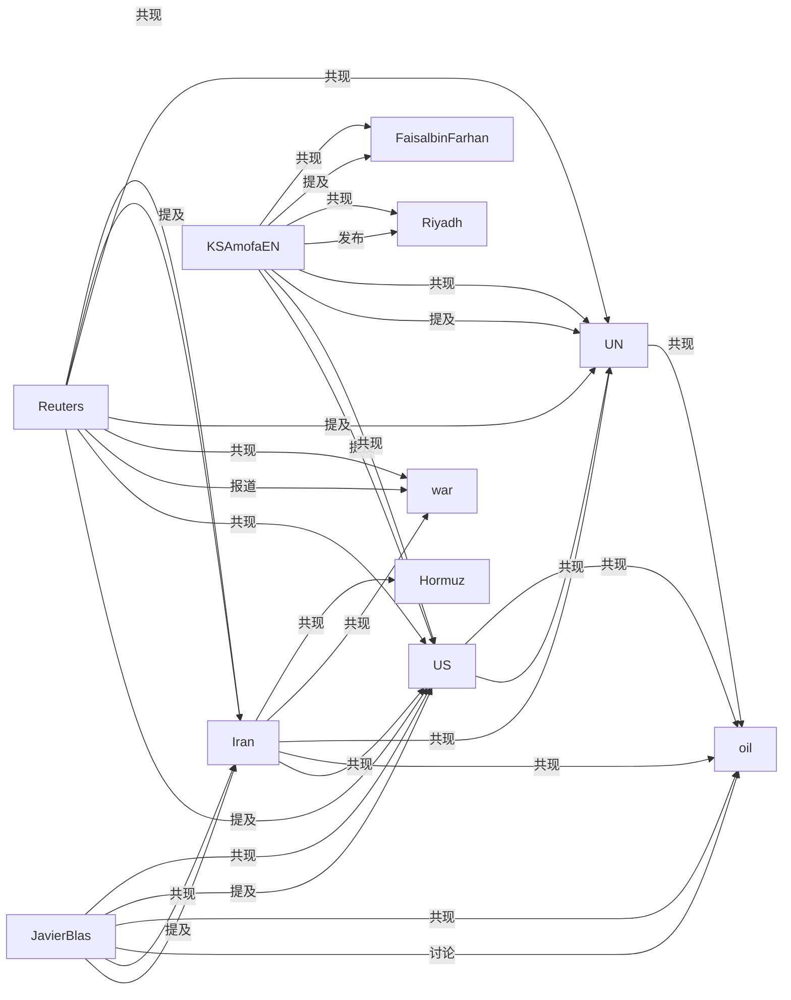

# 📊 情报关系图谱

> 生成时间: 2026-04-29 20:06:00
> 查询: 历史抓取信息
> 实体数: 117 | 关系数: 737

## 🐦 账号 (61)

- [[entities/KSAmofaEN|KSAmofaEN]] (提及 47 次, 互动 5,396)
- [[entities/Reuters|Reuters]] (提及 41 次, 互动 1,259)
- [[entities/JavierBlas|JavierBlas]] (提及 30 次, 互动 74,401)
- [[entities/realDonaldTrump|realDonaldTrump]] (提及 13 次, 互动 5,884,000)
- [[entities/FaisalbinFarhan|FaisalbinFarhan]] (提及 10 次, 互动 1,431)
- [[entities/KingSalman|KingSalman]] (提及 5 次, 互动 273)
- [[entities/laurnorman|laurnorman]] (提及 3 次, 互动 526)
- [[entities/Axios|Axios]] (提及 2 次, 互动 328)
- [[entities/CFTC|CFTC]] (提及 2 次, 互动 7,892)
- [[entities/gbrew24|gbrew24]] (提及 2 次, 互动 531)
- [[entities/AdelAlJubeir|AdelAlJubeir]] (提及 2 次, 互动 161)
- [[entities/W_Elkhereiji|W_Elkhereiji]] (提及 2 次, 互动 111)
- [[entities/grok|grok]] (提及 2 次, 互动 4)
- [[entities/Opinion|Opinion]] (提及 2 次, 互动 276)
- [[entities/elonmusk|elonmusk]] (提及 1 次, 互动 103,000)

## 🏛️ 组织机构 (10)

- [[entities/UN|UN]] (提及 52 次, 互动 4,574,512)
- [[entities/Fed|Fed]] (提及 6 次, 互动 351,428)
- [[entities/OPEC|OPEC]] (提及 5 次, 互动 5,620)
- [[entities/White House|White House]] (提及 2 次, 互动 97)
- [[entities/Pentagon|Pentagon]] (提及 2 次, 互动 4)
- [[entities/OPEC+|OPEC+]] (提及 2 次, 互动 1,071)
- [[entities/IMF|IMF]] (提及 1 次, 互动 520)
- [[entities/WSJ|WSJ]] (提及 1 次, 互动 399)
- [[entities/Bloomberg|Bloomberg]] (提及 1 次, 互动 151)
- [[entities/Reuters|Reuters]] (提及 1 次, 互动 19)

## 📍 地点 (16)

- [[entities/US|US]] (提及 77 次, 互动 1,905,538)
- [[entities/Iran|Iran]] (提及 56 次, 互动 33,295)
- [[entities/Hormuz|Hormuz]] (提及 16 次, 互动 13,851)
- [[entities/Gulf|Gulf]] (提及 9 次, 互动 2,377)
- [[entities/Saudi Arabia|Saudi Arabia]] (提及 7 次, 互动 2,533)
- [[entities/Tehran|Tehran]] (提及 6 次, 互动 3,402)
- [[entities/China|China]] (提及 6 次, 互动 1,996)
- [[entities/Russia|Russia]] (提及 5 次, 互动 199)
- [[entities/Washington|Washington]] (提及 5 次, 互动 306)
- [[entities/United States|United States]] (提及 4 次, 互动 992,531)
- [[entities/Middle East|Middle East]] (提及 3 次, 互动 2,156)
- [[entities/Beijing|Beijing]] (提及 2 次, 互动 73)
- [[entities/Moscow|Moscow]] (提及 1 次, 互动 48)
- [[entities/Israel|Israel]] (提及 1 次, 互动 0)
- [[entities/USA|USA]] (提及 1 次, 互动 0)

## 💰 资产 (4)

- [[entities/oil|oil]] (提及 33 次, 互动 69,163)
- [[entities/crude|crude]] (提及 5 次, 互动 49,642)
- [[entities/dollar|dollar]] (提及 2 次, 互动 26)
- [[entities/gold|gold]] (提及 1 次, 互动 26)

## ⚡ 事件 (8)

- [[entities/war|war]] (提及 25 次, 互动 999,104)
- [[entities/blockade|blockade]] (提及 10 次, 互动 10,880)
- [[entities/attack|attack]] (提及 6 次, 互动 267)
- [[entities/sanction|sanction]] (提及 5 次, 互动 1,934)
- [[entities/missile|missile]] (提及 2 次, 互动 9,462)
- [[entities/ceasefire|ceasefire]] (提及 2 次, 互动 400)
- [[entities/conflict|conflict]] (提及 1 次, 互动 13)
- [[entities/invasion|invasion]] (提及 1 次, 互动 30)

## 🏷️ 话题 (18)

- [[entities/Riyadh|Riyadh]] (提及 11 次, 互动 759)
- [[entities/Iran|Iran]] (提及 5 次, 互动 10)
- [[entities/Statement|Statement]] (提及 3 次, 互动 1,097)
- [[entities/IranWar‌|IranWar‌]] (提及 3 次, 互动 0)
- [[entities/Jeddah|Jeddah]] (提及 2 次, 互动 148)
- [[entities/USCoastGuard|USCoastGuard]] (提及 1 次, 互动 0)
- [[entities/Hormuz|Hormuz]] (提及 1 次, 互动 6)
- [[entities/America|America]] (提及 1 次, 互动 6)
- [[entities/Geopolitics|Geopolitics]] (提及 1 次, 互动 3)
- [[entities/USPolicy|USPolicy]] (提及 1 次, 互动 3)
- [[entities/US|US]] (提及 1 次, 互动 1)
- [[entities/Ceasefire|Ceasefire]] (提及 1 次, 互动 1)
- [[entities/Breaking|Breaking]] (提及 1 次, 互动 1)
- [[entities/war|war]] (提及 1 次, 互动 0)
- [[entities/usa|usa]] (提及 1 次, 互动 0)

## 🔗 关系网络

## 📈 高互动实体

1. [[entities/realDonaldTrump|realDonaldTrump]] - 互动量 5,884,000
2. [[entities/UN|UN]] - 互动量 4,574,512
3. [[entities/US|US]] - 互动量 1,905,538
4. [[entities/war|war]] - 互动量 999,104
5. [[entities/United States|United States]] - 互动量 992,531
6. [[entities/Fed|Fed]] - 互动量 351,428
7. [[entities/DanScavino|DanScavino]] - 互动量 130,000
8. [[entities/MELANIATRUMP|MELANIATRUMP]] - 互动量 120,000
9. [[entities/elonmusk|elonmusk]] - 互动量 103,000
10. [[entities/FoxNews|FoxNews]] - 互动量 76,200
